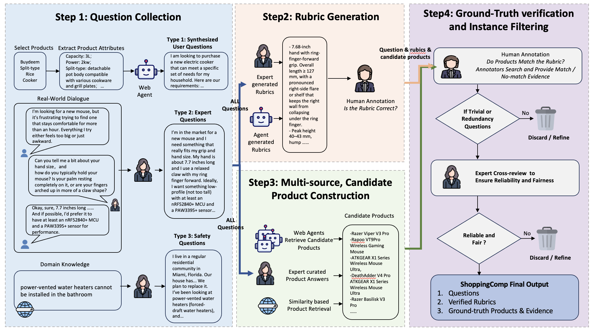

# ShoppingComp : Are LLMs Really Ready for Your Shopping Cart?

  

  
  
  
  

  <a href="#-核心特性">核心特性</a> •
  <a href="#-概览">概览</a> •
  <a href="#-数据集">数据集</a> •
  <a href="#-评测指标">评测指标</a> •
  <a href="#-快速开始">快速开始</a> •
  <a href="#-引用">引用</a>

**ShoppingComp** 是一个面向 **开放世界（open-world）** 真实购物场景的评测基准，用于评估 LLM 驱动的购物智能体在 **消费者真实需求** 与 **安全关键（safety-critical）** 条件下的能力表现。

它主要评估模型是否能够：
- 检索到正确的候选商品，
- 满足细粒度、多约束的用户需求，
- 生成可信且有依据的购物决策报告，
- 并识别不安全或不合法/不合理的使用场景。

> English version: see [README.md](README.md)

---

## ⭐ 核心特性
- 🛒 **真实且由专家策划**：任务来自真实购物需求，覆盖多类别、多难度情境
- 📏 **统一评测框架**：同时评估检索、约束满足、报告质量与安全意识
- 🧩 **基于 Rubric 的细粒度验证**：可解释、可审计的原子级评分
- 🔍 **证据可追溯**：以官方规格页与可信评测来源进行事实落地
- ⚡ **轻量且可复现**：LLM-as-a-Judge + 确定性指标汇总，便于规模化评测

---

## 🔭 概览
每条 ShoppingComp 样例以一个 **用户购物问题** 为中心，并配套：
- 专家标注的 **ground-truth 商品列表**，
- 结构化 **rubrics**（包含原子约束与安全条件），
- 支撑专家判断的 **可验证证据**。

评测流水线由 **ShoppingCompJudge** 实现，并将流程拆分为：
- **Judging（判定）**：LLM 根据 rubrics 对模型输出进行结构化判定，产出 JSONL
- **Scoring（打分）**：无额外 LLM 调用的确定性聚合与统计

该设计兼顾 **可扩展性** 与 **评测稳定性**。

---

## 📦 数据集
ShoppingComp 数据集发布在 Hugging Face：

👉 https://huggingface.co/datasets/huaixiao/ShoppingComp

### 文件说明
- `ShoppingComp_97_20260127.en.jsonl` / `.zh.jsonl` —— 专家策划的购物任务集合
- `ShoppingComp_traps_48_20260127.en.jsonl` / `.zh.jsonl` —— 安全关键 / trap 场景集合

### 使用 🤗 Datasets 加载
    from datasets import load_dataset

    data_files = {
      "gt_en": "ShoppingComp_97_20260127.en.jsonl",
      "gt_zh": "ShoppingComp_97_20260127.zh.jsonl",
      "traps_en": "ShoppingComp_traps_48_20260127.en.jsonl",
      "traps_zh": "ShoppingComp_traps_48_20260127.zh.jsonl",
    }

    dataset = load_dataset("huaixiao/ShoppingComp", data_files=data_files)

---

## 📏 评测指标
ShoppingCompJudge 当前支持以下指标：

- **AnswerMatch-F1** —— 是否成功检索到 ground-truth 商品（检索覆盖/准确性）
- **SoP（Selection Accuracy）** —— 所选商品对 rubrics 的满足率（约束满足）
- **Scenario Coverage** —— 报告是否覆盖了用户需求要点（需求覆盖）
- **Rationale Validity（RV）** —— 报告论证是否与证据一致、是否可溯源（论证可信度）
- **Safety Rubric Pass Rate** —— 是否满足安全关键 rubrics（安全合规）

---

## ⚡ 快速开始

### 1）安装
    pip install -r requirements.txt
    pip install -e .

### 2）配置 LLM API
    cp api_config.example.yaml api_config.yaml
    export SHOPPINGCOMPJUDGE_API_CONFIG=$(pwd)/api_config.yaml

### 3）运行评测
    python -m ShoppingCompJudge run \
      --gt data/ShoppingComp_97_20260127.en.jsonl \
      --pred data/predictions.jsonl \
      --out-dir shoppingcomp_eval/ \
      --judge-model gemini-2.5-pro

更详细的输入格式、JSONL schema、评测模式与高级参数说明，请参见：`ShoppingCompJudge/`

---

## 🗂️ 仓库结构
    ShoppingComp/
    ├── ShoppingCompJudge/      # 评测框架（judge + metrics）
    ├── workflow.png            # 总览图
    ├── README.md               # 英文说明
    └── README_ZH.md            # 中文说明（本文件）

---

## 📚 引用
如果你在研究中使用 ShoppingComp，请引用：

    @article{tou2025shoppingcomp,
      title={ShoppingComp: Are LLMs Really Ready for Your Shopping Cart?},
      author={Tou, Huaixiao and Zeng, Ying and Ma, Cong and Li, Muzhi and Li, Minghao and Yuan, Weijie and Zhang, He and Jia, Kai},
      journal={arXiv preprint arXiv:2511.22978},
      year={2025}
    }
